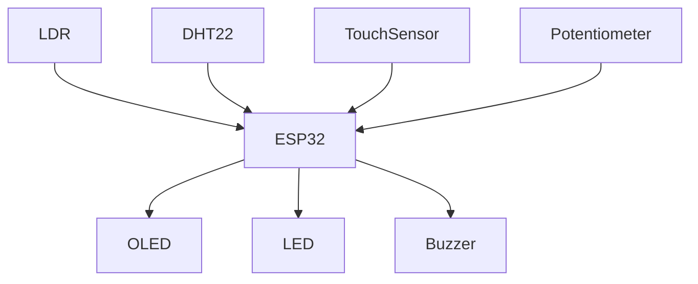
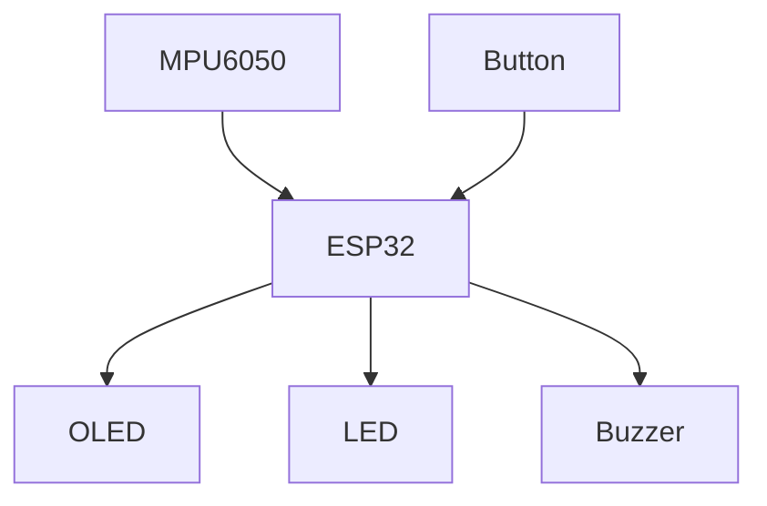

# ESP32 Beginner Projects

A collection of beginner-level ESP32 projects demonstrating sensor interfacing, automation, and embedded system design.

---

# Table of Contents

1. Smart Desk – Intelligent Workspace Assistant
2. Project Guardian – Smart Safety Companion

---

# Project 1 – Smart Desk: Intelligent Workspace Assistant

## Components Used

| Component | Quantity |
|-----------|----------|
| ESP32 Development Board | 1 |
| LDR | 1 |
| 10kΩ Resistor | 1 |
| DHT22 Temperature & Humidity Sensor | 1 |
| Capacitive Touch Sensor | 1 |
| Potentiometer (10kΩ) | 1 |
| OLED Display (128×64 I2C) | 1 |
| LED | 1 |
| 220Ω Resistor | 1 |
| Active Buzzer | 1 |
| Breadboard | 1 |
| Jumper Wires | As Required |
| USB Cable | 1 |

---

## Wiring

| ESP32 Pin | Connected To |
|------------|--------------|
| 3.3V | OLED VCC |
| GND | OLED GND |
| GPIO21 | OLED SDA |
| GPIO22 | OLED SCL |
| GPIO34 | LDR Voltage Divider Output |
| GPIO35 | Potentiometer Wiper |
| GPIO4 | DHT22 DATA |
| GPIO13 | Touch Sensor OUT |
| GPIO2 | LED Anode |
| GPIO15 | Buzzer Positive |
| 3.3V | DHT22 VCC |
| GND | DHT22 GND |
| 3.3V | Potentiometer VCC |
| GND | Potentiometer GND |
| GND | LED Cathode (220Ω Resistor) |
| GND | Buzzer Negative |

---

## Circuit Diagram

### Functional Diagram

```text
               SMART DESK
                        │
          ┌─────────────┼─────────────┐
          ↓             ↓             ↓
        LIGHT      TEMPERATURE    USER INPUT
         LDR           DHT22       Touch Sensor
          │             │             │
          └─────────────┼─────────────┘
                        ↓
                      ESP32
                        ↓
                Decide What To Do
                  /     ↓     \
                LED    OLED   Buzzer
```

---




---

### Wiring Diagram 

```text
               +--------------------+
               |       ESP32        |
               |                    |
GPIO21 --------| SDA                |
GPIO22 --------| SCL                |
GPIO34 --------| LDR                |
GPIO35 --------| POT                |
GPIO4 ---------| DHT22              |
GPIO13 --------| TOUCH              |
GPIO2 ---------| LED                |
GPIO15 --------| BUZZER             |
               +---------+----------+
                         |
      +------------------+-------------------+
      |                  |                   |
    OLED               DHT22               LDR
```

---

## Arduino Code

```cpp
#include <Wire.h>
#include <Adafruit_GFX.h>
#include <Adafruit_SSD1306.h>
#include <DHT.h>

#define SCREEN_WIDTH 128
#define SCREEN_HEIGHT 64
#define OLED_RESET -1

Adafruit_SSD1306 display(
SCREEN_WIDTH,
SCREEN_HEIGHT,
&Wire,
OLED_RESET
);

#define DHTPIN 4
#define DHTTYPE DHT22

DHT dht(DHTPIN, DHTTYPE);

const int ldrPin = 34;
const int potPin = 35;
const int touchPin = 13;

const int ledPin = 2;
const int buzzerPin = 15;

void setup()
{
Serial.begin(115200);

pinMode(ledPin, OUTPUT);
pinMode(buzzerPin, OUTPUT);

display.begin(
SSD1306_SWITCHCAPVCC,
0x3C
);

display.clearDisplay();

dht.begin();
}

void loop()
{
int lightValue = analogRead(ldrPin);
int threshold = analogRead(potPin);

float temperature = dht.readTemperature();
float humidity = dht.readHumidity();

bool touch = digitalRead(touchPin);

if(lightValue < threshold)
digitalWrite(ledPin,HIGH);
else
digitalWrite(ledPin,LOW);

if(
temperature > 30 ||
humidity < 35 ||
humidity > 70
)
digitalWrite(buzzerPin,HIGH);
else
digitalWrite(buzzerPin,LOW);

display.clearDisplay();

display.setTextSize(1);

display.setCursor(0,0);
display.println("SMART DESK");

display.setCursor(0,15);
display.print("Temp:");
display.println(temperature);

display.setCursor(0,28);
display.print("Hum:");
display.println(humidity);

display.setCursor(0,41);
display.print("Light:");
display.println(lightValue);

display.setCursor(0,54);

if(touch)
display.println("Touch");

else
display.println("Monitoring");

display.display();

delay(300);
}
```

---

## Code Upload Instructions

1. Connect ESP32.
2. Select ESP32 board.
3. Select COM port.
4. Upload the sketch.
5. Open Serial Monitor (optional).

---

## Expected Output

- OLED continuously displays:
  - Temperature
  - Humidity
  - Light Level
  - Touch Status
- LED turns ON automatically when the workspace becomes dark.
- LED turns OFF when sufficient light is available.
- Buzzer activates if:
  - Temperature exceeds 30°C
  - Humidity is below 35%
  - Humidity is above 70%
- Touch sensor updates the OLED status.

---

# Project 2 – Project Guardian: Smart Safety Companion

## Components Used

| Component | Quantity |
|-----------|----------|
| ESP32 Development Board | 1 |
| MPU6050 | 1 |
| OLED Display (128×64 I2C) | 1 |
| LED | 1 |
| 220Ω Resistor | 1 |
| Active Buzzer | 1 |
| Push Button | 1 |
| Breadboard | 1 |
| Jumper Wires | As Required |
| USB Cable | 1 |

---

## Wiring

| ESP32 Pin | Connected To |
|------------|--------------|
| GPIO21 | OLED SDA |
| GPIO22 | OLED SCL |
| GPIO21 | MPU6050 SDA |
| GPIO22 | MPU6050 SCL |
| 3.3V | MPU6050 VCC |
| GND | MPU6050 GND |
| GPIO2 | LED Anode |
| GPIO15 | Buzzer Positive |
| GPIO4 | Push Button |
| GND | Button Other Terminal |
| GND | LED Cathode through 220Ω |
| GND | Buzzer Negative |

---

## Circuit Diagram

### Functional Diagram

```text
          MPU6050
     Motion + Orientation
              ↓
           ESP32
              ↓
     "Was a fall detected?"
          ↙       ↘
        NO         YES
        ↓           ↓
    Monitor     Buzzer + LED
                    ↓
              OLED Warning
                    ↓
             Cancel Button
```

---




---

### Wiring Diagram 

```text
              +------------------+
              |      ESP32       |
              |                  |
GPIO21 -------- SDA              |
GPIO22 -------- SCL              |
GPIO2  -------- LED              |
GPIO15 -------- Buzzer           |
GPIO4  -------- Push Button      |
              +--------+---------+
                       |
          +------------+-----------+
          |                        |
      MPU6050                  OLED
```

---

## Arduino Code

```cpp
#include <Wire.h>
#include <Adafruit_MPU6050.h>
#include <Adafruit_Sensor.h>
#include <Adafruit_GFX.h>
#include <Adafruit_SSD1306.h>

Adafruit_MPU6050 mpu;

Adafruit_SSD1306 display(
128,
64,
&Wire,
-1
);

const int ledPin = 2;
const int buzzerPin = 15;
const int buttonPin = 4;

void setup()
{
Serial.begin(115200);

pinMode(ledPin,OUTPUT);
pinMode(buzzerPin,OUTPUT);
pinMode(buttonPin,INPUT_PULLUP);

display.begin(
SSD1306_SWITCHCAPVCC,
0x3C
);

display.clearDisplay();

mpu.begin();
}

void loop()
{
sensors_event_t a,g,temp;

mpu.getEvent(
&a,
&g,
&temp
);

float accel =
sqrt(
a.acceleration.x*a.acceleration.x+
a.acceleration.y*a.acceleration.y+
a.acceleration.z*a.acceleration.z
);

float gyro =
sqrt(
g.gyro.x*g.gyro.x+
g.gyro.y*g.gyro.y+
g.gyro.z*g.gyro.z
);

display.clearDisplay();

display.setCursor(0,0);

display.setTextSize(1);

display.println("PROJECT GUARDIAN");

if(
accel > 28 &&
gyro > 4
)
{
digitalWrite(ledPin,HIGH);

digitalWrite(buzzerPin,HIGH);

display.println("FALL DETECTED");

display.println("Press Button");

if(
digitalRead(buttonPin)==LOW
)
{
digitalWrite(ledPin,LOW);

digitalWrite(buzzerPin,LOW);
}
}
else
{
digitalWrite(ledPin,LOW);

digitalWrite(buzzerPin,LOW);

display.println("Monitoring");
}

display.display();

delay(100);
}
```

---

## Code Upload Instructions

1. Connect ESP32.
2. Select ESP32 board.
3. Select COM port.
4. Upload the sketch.
5. Open Serial Monitor (optional).

---

## Expected Output

- OLED displays **Monitoring** during normal operation.
- MPU6050 continuously monitors motion.
- If a fall is detected:
  - OLED displays **FALL DETECTED**
  - LED turns ON.
  - Buzzer turns ON.
- Pressing the push button turns OFF the LED and buzzer.
- The system resumes monitoring after the alert is cleared.

---

# End of Cookbook

**Cookbook:** ESP32 Beginner Projects