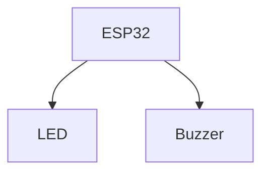

# ESP32 Basics

A beginner-friendly cookbook containing the setup steps and basic ESP32 projects.

---

# Table of Contents

1. Prerequisites
   - Arduino IDE Installation
   - ESP32 Board Installation
   - Required Libraries
2. Project 1 – Hello Hardware (Serial Monitor)
3. Project 2 – LED Blink & Buzzer
4. Project 3 – Smart Light Control using Potentiometer

---

# Prerequisites

## 1. Install Arduino IDE

1. Download Arduino IDE from https://www.arduino.cc/en/software
2. Install the application.
3. Launch Arduino IDE.

---

## 2. Install ESP32 Board Package

1. Open Arduino IDE.
2. Go to **File → Preferences**.
3. Add the following URL to **Additional Boards Manager URLs**:

```
https://raw.githubusercontent.com/espressif/arduino-esp32/gh-pages/package_esp32_index.json
```

4. Click **OK**.
5. Open **Tools → Board → Boards Manager**.
6. Search for **ESP32**.
7. Install **ESP32 by Espressif Systems**.
8. Select your ESP32 board from:

```
Tools → Board → ESP32 Arduino
```

---

## 3. Required Libraries

### Projects Included

- Hello Hardware
- LED Blink & Buzzer
- Smart Light Control

### Required Libraries

No external libraries are required.

---

# Project 1 — Hello Hardware (Serial Monitor)

---

## Components Used

| Component | Quantity |
|-----------|----------|
| ESP32 Development Board | 1 |
| USB Cable | 1 |

---

## Wiring

No external wiring required.

Simply connect the ESP32 to your computer using the USB cable.


---

## Block Diagram
---
```text
+-------------+
| Computer    |
+-------------+
       |
    USB Cable
       |
+-------------+
|    ESP32    |
+-------------+
```
---

## Arduino Code

```cpp
#define LED2 2  // Some board has on pin 2, some board has LED on pin 1

void setup() {
  Serial.begin(115200);

  //    Serial.println("Hello Hardware!");// Will print single time
  pinMode(LED2, OUTPUT);
}

void loop() {

  Serial.println("Hello Hardware!");  //Will print repeatedly
  digitalWrite(LED2, HIGH);//Instruction to make the LED on
  delay(100);  //This is in ms(miliseconds) With delay of 0.1 second, 1 second = 1000ms

  digitalWrite(LED2, LOW);//Instruction to make the LED off
  delay(900);// Delay of 0.9 second, and this will make the entire loop of 1 second
}
```

---

## Code Upload Instructions

1. Connect ESP32.
2. Select ESP32 Board.
3. Select COM Port.
4. Click **Upload**.
5. Open **Serial Monitor**.
6. Set baud rate to **115200**.

---

## Expected Output

Serial Monitor

```text
Hello Hardware!
```

---

# Project 2 — LED Blink & Buzzer

---

## Components Used

| Component | Quantity | Comment |
|-----------|----------|---------|
| ESP32 Development Board | 1 |
| LED | 1 | Traffic Light Model
| 220Ω Resistor | 1 | In built in the light model
| Active Buzzer | 1 |
| Breadboard | 1 |
| Jumper Wires | Few |
| USB Cable | 1 |

---

## Wiring

| ESP32 Pin | Connected To |
|------------|--------------|
| GPIO2 | LED Anode |
| GND | LED Cathode through 220Ω resistor |
| GPIO15 | Buzzer Positive |
| GND | Buzzer Negative |

---

### Breadboard Internal Connection


### Step 1:


## Block Diagram



---


```text
          +-------------+
          |    ESP32    |
          |             |
GPIO2 ----|-------------|---- LED ----220Ω---- GND

GPIO15 ---|-------------|---- Buzzer ---------- GND
          +-------------+
```

---

## Arduino Code

```cpp
const int ledPin = 2;
const int buzzerPin = 15;

void setup()
{
    pinMode(ledPin, OUTPUT);
    pinMode(buzzerPin, OUTPUT);
}

void loop()
{
    digitalWrite(ledPin, HIGH);
    digitalWrite(buzzerPin, HIGH);

    delay(1000);

    digitalWrite(ledPin, LOW);
    digitalWrite(buzzerPin, LOW);

    delay(1000);
}
```

---

## Code Upload Instructions

1. Connect ESP32.
2. Select ESP32 Board.
3. Select COM Port.
4. Upload the code.

---

## Expected Output

- LED blinks every second.
- Buzzer turns ON and OFF every second.

---

# Project 3 — Smart Light Control using LDR

---

## Components Used

| Component | Quantity |
|-----------|----------|
| ESP32 Development Board | 1 |
| Potentiometer (10kΩ) | 1 |
| LED | 1 |
| 220Ω Resistor | 1 |
| Breadboard | 1 |
| Jumper Wires | Few |
| USB Cable | 1 |

---

## Wiring

| ESP32 Pin | Connected To |
|------------|--------------|
| GPIO34 | Potentiometer Wiper |
| 3.3V | Potentiometer VCC |
| GND | Potentiometer GND |
| GPIO2 | LED Anode |
| GND | LED Cathode through 220Ω resistor |

---

## Block Diagram

---

```text
          Potentiometer

      3.3V
        |
        |
      [====]
        |
GPIO34--+
        |
       GND


                ESP32

GPIO2 ---------------- LED ----220Ω---- GND
```

---

## Arduino Code

```cpp
const int LDRPin = 22;
const int ledPin = 2;

void setup()
{
    pinMode(ledPin, OUTPUT);
    pinMode(LDRPin, INPUT_PULLUP);
    Serial.begin(115200);
}

void loop()
{
    int sensorValue = digitalRead(LDRPin);

    Serial.println(sensorValue);

    if(sensorValue == 1)//Logic can be changed
    
    {
        digitalWrite(ledPin, HIGH);
    }
    else
    {
        digitalWrite(ledPin, LOW);
    }

    delay(100);
}
```

---

## Code Upload Instructions

1. Connect ESP32.
2. Select ESP32 Board.
3. Select COM Port.
4. Upload the sketch.
5. Open Serial Monitor at **115200 baud**.

---

## Expected Output

- Rotating the potentiometer changes the analog value shown in the Serial Monitor.
- When the analog value exceeds approximately **2000**, the LED turns ON.
- When the analog value falls below **2000**, the LED turns OFF.

---

# End of Cookbook

**Cookbook:** ESP32 Basics